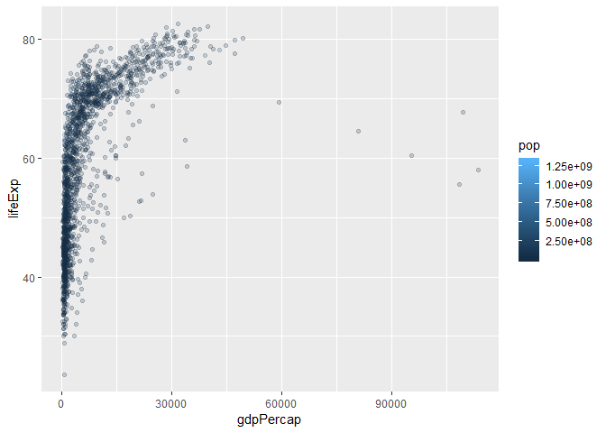
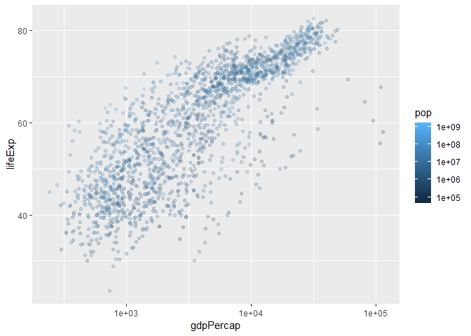
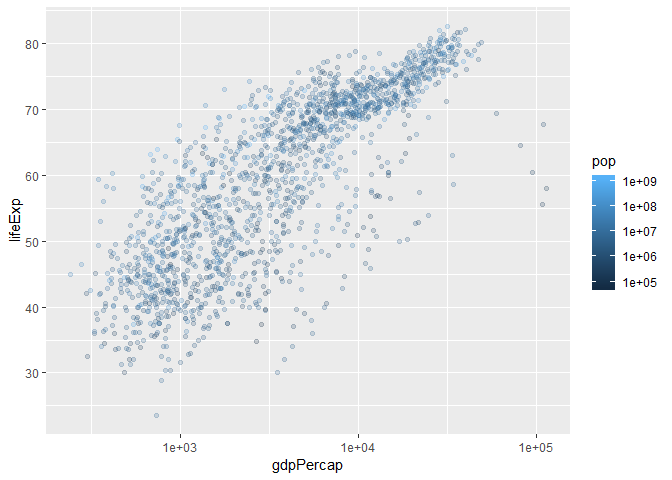
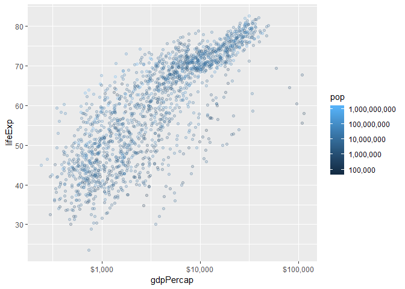
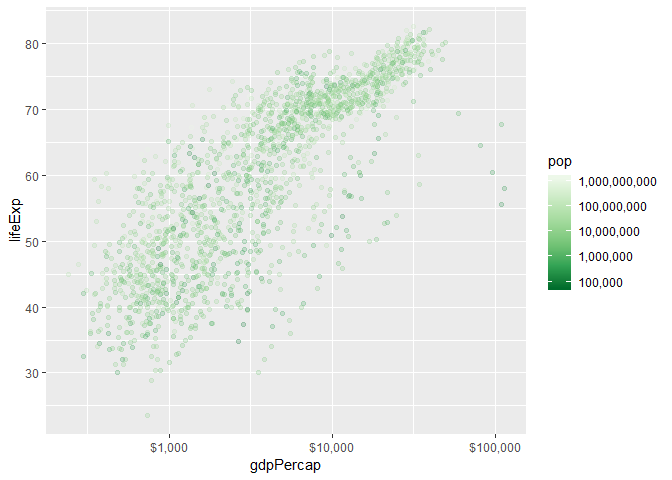
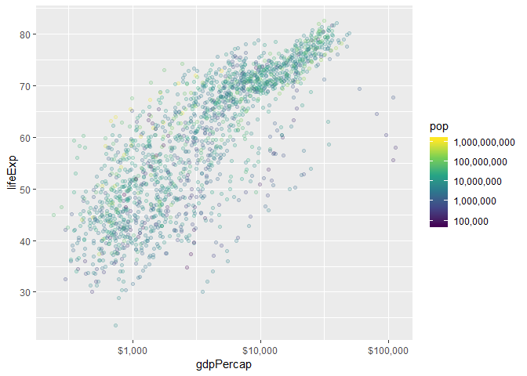
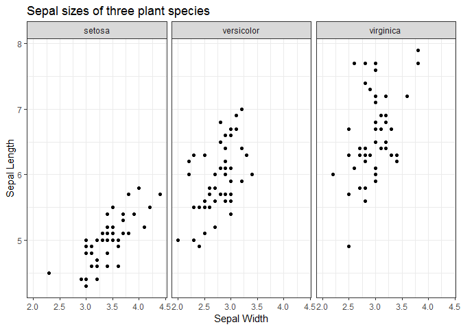
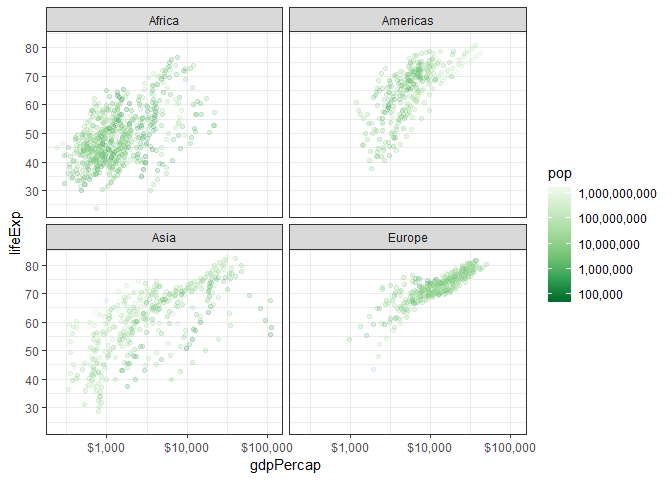

cm013 Exercise
================

``` r
suppressPackageStartupMessages(library(tidyverse))
library(gapminder)
```

Saving Graphs to File
=====================

-   Don't use the mouse
-   Use `ggsave` for ggplot
    -   Practice by saving the following plot to file:

``` r
p <- ggplot(mtcars, aes(hp, wt)) + 
    geom_point()
ggsave("my_plot.png", p)
```

    ## Saving 7 x 5 in image

-   Base R way: print plots "to screen", sandwiched between `pdf()`/`jpeg()`/`png()`... and `dev.off()`.
-   Vector vs. raster: Images are stored on your computer as either *vector* or *raster*.
    -   **Raster**: an `n` by `m` grid of pixels, each with its own colour. `jpeg`, `png`, `gif`, `bmp`.
    -   **Vector**: represented as shapes and lines. `pdf`, [`svg`](https://www.w3schools.com/graphics/svg_intro.asp).
    -   For tips: ["10 tips for making your R graphics look their best""](http://blog.revolutionanalytics.com/2009/01/10-tips-for-making-your-r-graphics-look-their-best.html).

Scales; Colour
==============

Scale functions in `ggplot2` take the form `scale_[aesthetic]_[mapping]()`.

Let's first focus on the following plot:

``` r
(p_scales <- ggplot(gapminder, aes(gdpPercap, lifeExp)) +
     geom_point(aes(colour=pop), alpha=0.2))
```



``` r
p_scales + 
    scale_x_log10() +
    scale_colour_continuous(trans="log10")
```



1.  Change the y-axis tick mark spacing to 10; change the colour spacing to include all powers of 10.

``` r
p_scales +
    scale_x_log10() +
    scale_colour_continuous(
        trans  = "log10", 
        breaks = 10^(1:10)
    ) +
    scale_y_continuous(breaks=1:10*10)
```



1.  Specify `scales::*_format` in the `labels` argument of a scale function to do the following:
    -   Change the x-axis labels to dollar format (use `scales::dollar_format()`)
    -   Change the colour labels to comma format (use `scales::comma_format()`)

``` r
library(scales)
```

    ## 
    ## Attaching package: 'scales'

    ## The following object is masked from 'package:purrr':
    ## 
    ##     discard

    ## The following object is masked from 'package:readr':
    ## 
    ##     col_factor

``` r
p_scales +
    scale_x_log10(labels=dollar_format()) +
    scale_colour_continuous(
        trans  = "log10", 
        breaks = 10^(1:10),
        labels = comma_format()
    ) +
    scale_y_continuous(breaks=10*(1:10))
```



1.  Use `RColorBrewer` to change the colour scheme.
    -   Notice the three different types of scales: sequential, diverging, and continuous.

``` r
## All palettes the come with RColorBrewer:
RColorBrewer::display.brewer.all()
```


``` r
p_scales +
    scale_x_log10(labels=dollar_format()) +
    scale_color_distiller(
        trans   = "log10",
        breaks  = 10^(1:10),
        labels  = comma_format(),
        palette = "Greens"
    ) +
    scale_y_continuous(breaks=10*(1:10))
```



1.  Use `viridis` to change the colour to a colour-blind friendly scheme
    -   Hint: add `scale_colour_viridis_c` (`c` stands for continuous; `d` discrete).
    -   You can choose a palette with `option`.

``` r
p_scales +
    scale_x_log10(labels=dollar_format()) +
    scale_colour_viridis_c(
        trans   = "log10",
        breaks  = 10^(1:10),
        labels  = comma_format()
    ) +
    scale_y_continuous(breaks=10*(1:10))
```



Theming
=======

Changing the look of a graphic can be achieved through the `theme()` layer.

There are ["complete themes"](http://ggplot2.tidyverse.org/reference/ggtheme.html) that come with `ggplot2`, my favourite being `theme_bw` (I've grown tired of the default gray background, so `theme_bw` is refreshing).

1.  Change the theme of the following plot to `theme_bw()`:

``` r
ggplot(iris, aes(Sepal.Width, Sepal.Length)) +
     facet_wrap(~ Species) +
     geom_point() +
     labs(x = "Sepal Width",
          y = "Sepal Length",
          title = "Sepal sizes of three plant species") +
  theme_bw()
```



1.  Then, change font size of axis labels, and the strip background colour. Others?

``` r
ggplot(iris, aes(Sepal.Width, Sepal.Length)) +
     facet_wrap(~ Species) +
     geom_point() +
     labs(x = "Sepal Width",
          y = "Sepal Length",
          title = "Sepal sizes of three plant species") +
    theme_bw() +
    theme(axis.text = element_text(size=16),
          strip.background = element_rect(fill = "orange"))
```


Plotly
======

Consider the following plot:

``` r
(p <- gapminder %>% 
     filter(continent != "Oceania") %>% 
     ggplot(aes(gdpPercap, lifeExp)) +
     geom_point(aes(colour=pop), alpha=0.2) +
     scale_x_log10(labels=dollar_format()) +
     scale_colour_distiller(
         trans   = "log10",
         breaks  = 10^(1:10),
         labels  = comma_format(),
         palette = "Greens"
     ) +
     facet_wrap(~ continent) +
     scale_y_continuous(breaks=10*(1:10)) +
     theme_bw())
```



1.  Convert it to a `plotly` object by applying the `ggplotly()` function:

``` r
#install.packages("plotly")
#library("plotly")
#ggplotly(p)
```

1.  You can save a plotly graph locally as an html file. Try saving the above:
    -   NOTE: plotly graphs don't seem to show up in Rmd *notebooks*, but they do with Rmd *documents*.

``` r
#p %>% 
#    ggplotly() %>% 
#    htmlwidgets::saveWidget("LOCATION_GOES_HERE")
```

1.  Run this code to see the json format underneath:

``` r
#p %>% 
#    ggplotly() %>% 
#    plotly_json()
```

1.  Check out code to make a plotly object from scratch using `plot_ly()` -- scatterplot of gdpPercap vs lifeExp.
    -   Check out the [cheat sheet](https://images.plot.ly/plotly-documentation/images/r_cheat_sheet.pdf).

``` r
#plot_ly(gapminder, 
#        x = ~gdpPercap, 
#        y = ~lifeExp, 
#        type = "scatter",
#        mode = "markers",
#        opacity = 0.2) %>% 
#    layout(xaxis = list(type = "log"))
```

1.  Add population to form a z-axis for a 3D plot:

``` r
#plot_ly(gapminder, 
#        x = ~gdpPercap, 
#       y = ~lifeExp, 
#        z = ~pop,
#        type = "scatter3d",
#        mode = "markers",
#       opacity = 0.2)
```
